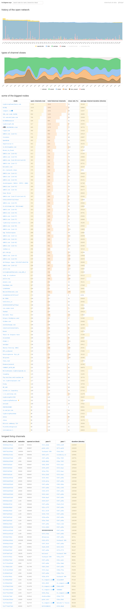
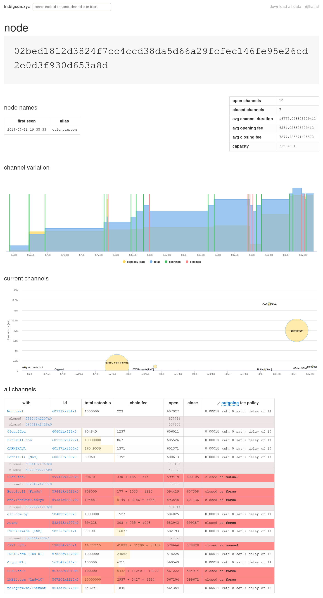

How to run
==========

1. Create a PostgreSQL database;
2. Either download a database dump from the current website to fill the initial values or use the files under `postgres/` to generate the initial schema.

### Running the website

1. Serve the data directly from the database using [PostgREST](https://github.com/PostgREST/postgrest/releases/latest) and the following configuration:
  ```
  db-uri = "postgres://yourpostgresdatabaseuri"
  db-schema = "public"
  db-anon-role = "web_anon"
  db-pool = 7
  server-host = "127.0.0.1"
  server-port = 11936
  max-rows = 10000
  ```
2. Run `npm install && make` to build the client-side JavaScript. All files will be in the `static/` directory.
3. Now you need an HTTP server proxy to serve the PostgREST API and the static site under the same domain. This at the naked path and that under the `/api/` path. Nginx will do it, but I use [Caddy](https://caddyserver.com/) with the following `Caddyfile`:
  ```
  ln.bigsun.xyz {
    handle /api/* {
      uri strip_prefix /api
      reverse_proxy localhost:11936 {
        header_up Accept application/json
        header_up Content-Type application/json
      }
    }
    handle {
      root * /home/fiatjaf/lnchannels/static
      try_files {path} /index.html
      file_server
    }
  }
  ```

### Updating the data

1. Run [sparko](https://github.com/fiatjaf/sparko) and generate a key for it with at least the permissions to call `listchannels` and `listnodes`.
2. Run [bitcoind](https://bitcoincore.org/en/download/) with `txindex=1`.
3. Somehow set the following environment variables:
  ```
POSTGRES_URL=postgres://yourpostgresdatabaseuri
SPARK_URL=http://yoursparkoaddress:port/rpc
SPARK_TOKEN=accesskeygeneratedonstep1
BITCOIN_RPC_ADDRESS=http://localhost:8332
BITCOIN_RPC_USER=bitcoinrpcuser
BITCOIN_RPC_PASSWORD=bitcoinrpcpass
ESPLORA_URL1=https://mempool.space/api
ESPLORA_URL2=https://blockstream.info/api
  ```
4. You can place all of the above in a file called `.env` and later user a program like [godotenv](https://github.com/joho/godotenv) to run things while setting them.
5. Install Python (must be python3.8 or greater I believe) dependencies from `requirements.txt` using any method you like (I do `virtualenv venv && venv/bin/pip install -r requirements.txt`).
6. Run `python -m getdata` (or `godotenv python -m getdata` if you're using an `.env` file or `godotenv venv/bin/python -m getdata` if you're using a virtualenv) once every day or hour or week, depending on how often you want to fetch new data -- the greater the interval between runs the more you'll miss shortlived channels, the smaller the interval more you'll clog your database with useless fee changes, also the process takes a long time to finish so I only run it once a day.

Screenshots (outdated)
===========





License
=======

Public domain, except you can't use for shitcoins.
